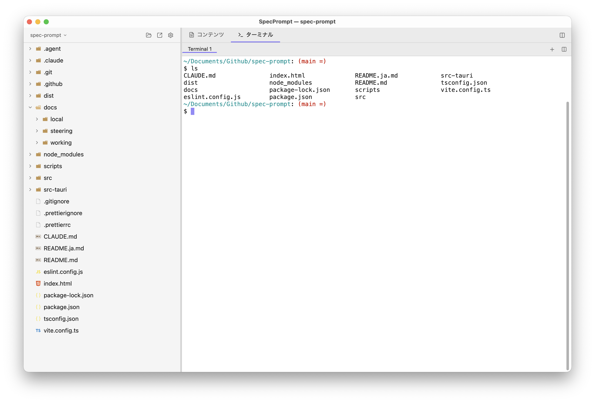
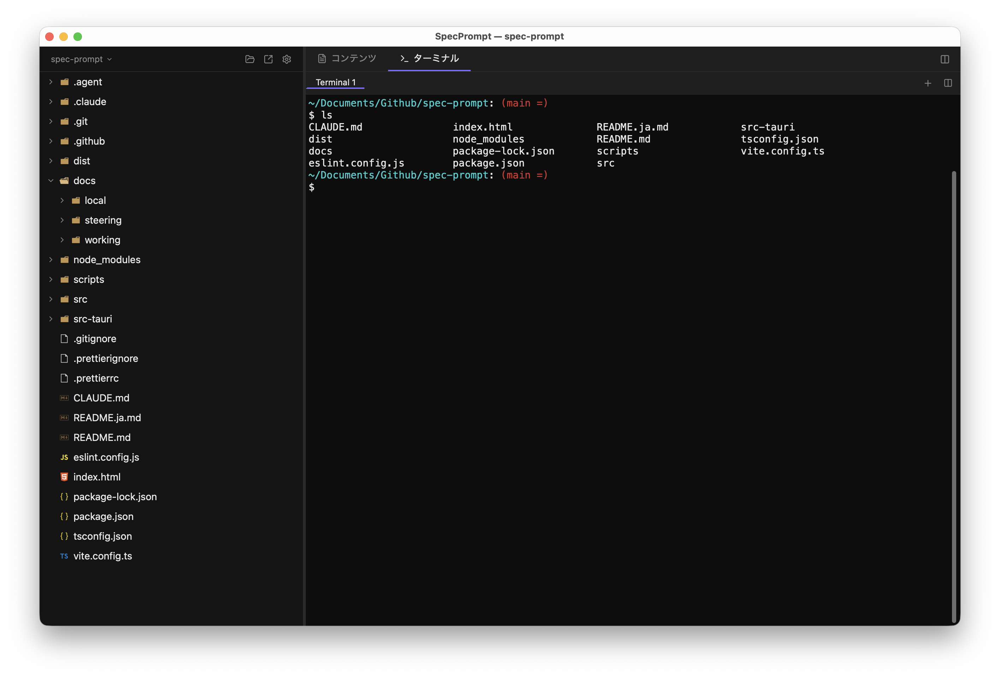

# SpecPrompt

**生成AIを用いた仕様駆動開発のための軽量デスクトップアプリ。**

仕様書の確認・AIへの指示・ファイル操作を、重いIDEに頼らず一つのウィンドウで完結させます。

[English version](README.md)

---

## 概要

SpecPrompt はマークダウンプレビューと統合ターミナルを一体化したデスクトップアプリです。仕様書を参照しながら Claude Code などのAI CLIツールを横並びで操作できます。メモリ使用量の目標は **200MB 以下**（VS Codeの約1/5）。

## スクリーンショット

| ライト | ダーク |
|---|---|
|  |  |

## 機能

| 機能 | 説明 |
|---|---|
| ファイルツリー | プロジェクト内のファイル・フォルダを階層表示 |
| 統合ターミナル | フル PTY ターミナル — Claude Code 等の AI CLI をアプリ内で直接実行 |
| マークダウンプレビュー | Mermaid ダイアグラム対応のリアルタイムレンダリング |
| コードビューア | 15言語以上に対応したシンタックスハイライト（読み取り専用） |
| パスパレット | `Ctrl+P` fuzzy検索でファイルパスをターミナルへ挿入 |
| 分割表示 | コンテンツとターミナルを左右・上下に並べて表示 |
| タブ管理 | コンテンツタブ・ターミナルタブの複数管理 |
| ドキュメントステータス | フロントマター による `draft / reviewing / approved` ステータス管理 |
| テーマ | ダーク / ライトモード切り替え |

## 技術スタック

| レイヤー | 技術 |
|---|---|
| デスクトップフレームワーク | Tauri v2（Rustバックエンド） |
| フロントエンド | React 19 + TypeScript |
| スタイリング | Tailwind CSS v4 |
| MDレンダリング | unified（remark + rehype） |
| コードハイライト | Shiki |
| ターミナルエミュレータ | alacritty-terminal（Rustクレート）+ Canvas 2D レンダラー |
| PTY管理 | portable-pty（Rustクレート） |
| ファイル監視 | tauri-plugin-fs |
| 状態管理 | Zustand + persist middleware |

## 動作環境

- macOS（最優先）、Windows、Linux
- Node.js 20 以上
- Rust（stable）

## はじめかた

```bash
# リポジトリをクローン
git clone https://github.com/sakamotchi/spec-prompt.git
cd spec-prompt

# 依存パッケージをインストール
npm install

# 開発サーバー起動（フロントエンド＋バックエンド同時）
npx tauri dev
```

## ビルド

```bash
# プロダクションビルド（macOS では .app と .dmg を生成）
npx tauri build
```

## キーボードショートカット

| ショートカット | 操作 |
|---|---|
| `Ctrl+Tab` | コンテンツモード ↔ ターミナルモードの切り替え |
| `⌘N` / `Ctrl+N` | 新規ウィンドウを開く |
| `Ctrl+P` | パスパレットを開く |
| `Ctrl+Click` | ツリーのファイルパスをアクティブなターミナルへ挿入 |

## 複数ウィンドウとタブ統合（macOS）

SpecPrompt は macOS のネイティブウィンドウタブに対応しています。複数プロジェクトを並行して扱う際に、ウィンドウを 1 つにまとめて切り替えられます。

### 新規ウィンドウを開く

- `⌘N` または File > New Window
- プロジェクトツリー上部の「新規ウィンドウ」ボタン
- フォルダ右クリック > 「新規ウィンドウで開く」

### 手動でタブ統合する

- いずれかのウィンドウをアクティブにして **View > Show Tab Bar** を実行するとタブバーが表示され、他のウィンドウをタイトルバーからドラッグして統合できます。
- または **Window > Merge All Windows** で一括統合できます。

### 自動タブ化を有効にする

**システム設定 > デスクトップと Dock > ウィンドウ > 書類をタブで開く** を **「常に」** にすると、新規ウィンドウは自動的に既存ウィンドウのタブとして開きます。

> **注**: Tauri v2 の制約で `NSWindow.tabbingMode = .preferred`（VS Code のような強制自動タブ化）は非対応です。システム設定が「常に」以外の場合は上記の手動手順を使用してください。

## ライセンス

MIT
