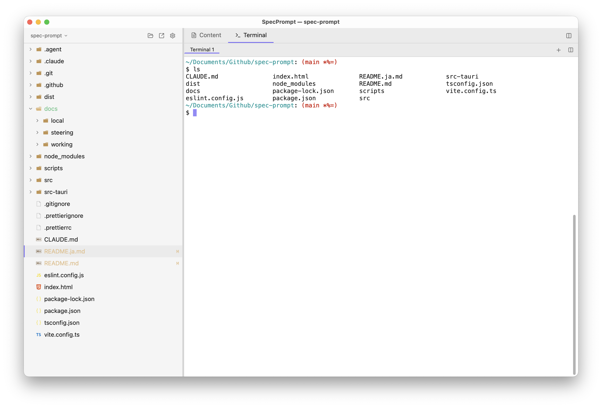
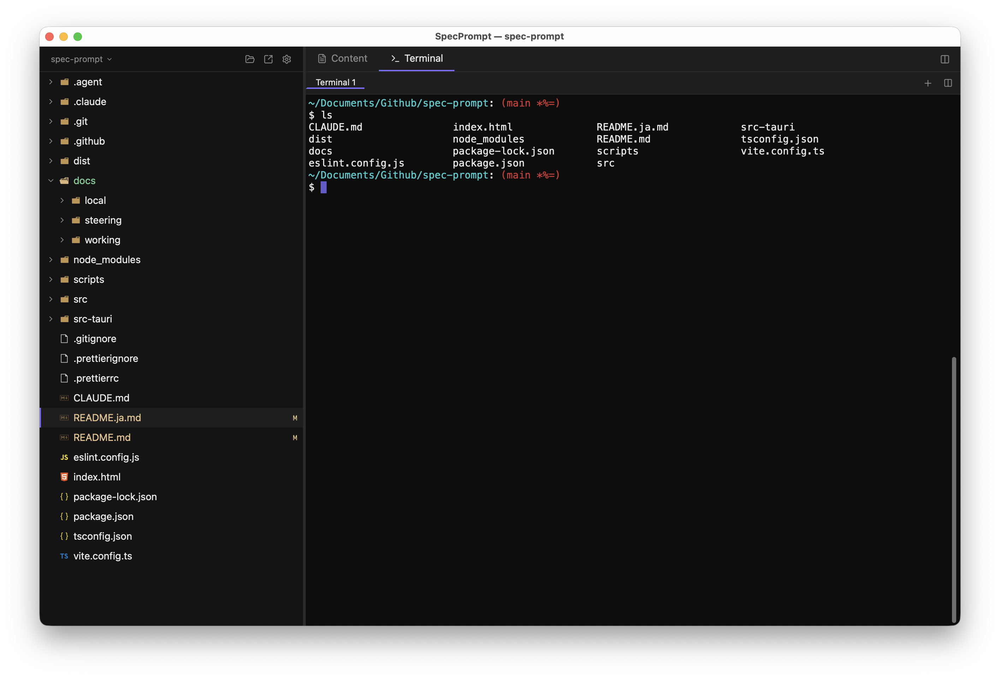

# SpecPrompt

**A lightweight desktop app for spec-driven development with AI.**

View your specs, run AI CLI tools, and browse files — all in one window, without the weight of a full IDE.

[日本語版はこちら](README.ja.md)

---

## Overview

SpecPrompt pairs a Markdown previewer with an integrated terminal so you can reference specs and issue AI CLI commands (e.g. Claude Code) side-by-side. It targets a memory footprint of **under 200 MB** — roughly one-fifth of VS Code.

## Screenshots

| Light | Dark |
|---|---|
|  |  |

## Features

| Feature | Description |
|---|---|
| File Tree | Hierarchical project navigator |
| Integrated Terminal | Full PTY terminal — run Claude Code and other AI CLIs directly |
| Markdown Preview | Real-time rendering with Mermaid diagram support |
| Code Viewer | Syntax-highlighted, read-only view for 15+ languages |
| Path Palette | `Ctrl+P` fuzzy-search palette to insert file paths into the terminal |
| Split View | Tile content and terminal panes side-by-side |
| Tab Management | Multiple content tabs and terminal tabs |
| Document Status | Front-matter based `draft / reviewing / approved` status tracking |
| Theme | Dark / Light mode |

## Tech Stack

| Layer | Technology |
|---|---|
| Desktop framework | Tauri v2 (Rust backend) |
| Frontend | React 19 + TypeScript |
| Styling | Tailwind CSS v4 |
| Markdown rendering | unified (remark + rehype) |
| Syntax highlighting | Shiki |
| Terminal emulator | alacritty-terminal (Rust) + Canvas 2D renderer |
| PTY management | portable-pty (Rust crate) |
| File watching | tauri-plugin-fs |
| State management | Zustand + persist middleware |

## Requirements

- macOS (primary), Windows, Linux
- Node.js 20+
- Rust (stable)

## Getting Started

```bash
# Clone the repository
git clone https://github.com/sakamotchi/spec-prompt.git
cd spec-prompt

# Install dependencies
npm install

# Start development server (frontend + backend)
npx tauri dev
```

## Build

```bash
# Production build (.app and .dmg on macOS)
npx tauri build
```

## Keyboard Shortcuts

| Shortcut | Action |
|---|---|
| `Ctrl+Tab` | Toggle between Content and Terminal mode |
| `⌘N` / `Ctrl+N` | Open a new window |
| `Ctrl+P` | Open path palette |
| `Ctrl+Click` | Insert file path into active terminal |

## Multiple Windows and Tab Merging (macOS)

SpecPrompt supports macOS native window tabs, so you can group multiple projects into one tabbed window instead of scattering them across your desktop.

### Open a new window

- `⌘N` or File > New Window
- "New Window" button at the top of the project tree
- Right-click on a folder > "Open in New Window"

### Merge windows manually into tabs

- Activate any window and choose **View > Show Tab Bar**. Drag another window's title bar onto the tab bar to merge it.
- Alternatively, **Window > Merge All Windows** merges every SpecPrompt window at once.

### Enable automatic tabbing

Set **System Settings > Desktop & Dock > Windows > Prefer tabs when opening documents** to **"Always"**. New windows will automatically open as tabs of the existing window.

> **Note**: Because Tauri v2 does not yet expose `NSWindow.tabbingMode = .preferred`, SpecPrompt cannot force automatic tabbing like VS Code does. If your system setting is not "Always", use the manual merge steps above.

## License

MIT
