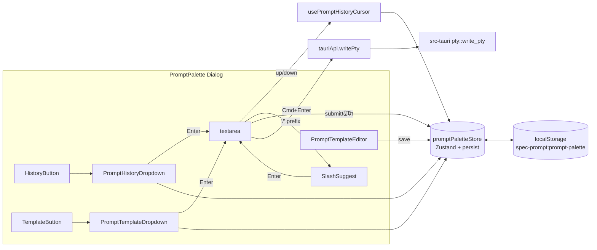

# 概要設計書 — プロンプトパレット 履歴・テンプレート機能

## 1. アーキテクチャ概要

本機能はフロントエンドに閉じた追加実装とする。Rust バックエンドの新規コマンドは追加せず、履歴・テンプレートの永続化は既存の `persist` middleware ＋ localStorage（ブラウザ API）で完結させる。



ポイント:

- 既存の送信パス（`handleSubmit` → `tauriApi.writePty`）は一切変更しない
- 履歴への push は**送信成功後**の副作用としてストアに追加するだけ
- ドロップダウンは Radix の Popover などを使わず、既存 Dialog 内の子要素として配置（`PathPalette` 同様のフラットな構造）

---

## 2. コンポーネント設計

### 2.1 フロントエンド

| コンポーネント | 配置 | 責務 |
|---|---|---|
| `PromptPalette` | `src/components/PromptPalette/PromptPalette.tsx`（改修） | ダイアログ全体。子ドロップダウン・SlashSuggest の表示制御、キーハンドラ統合 |
| `PromptHistoryDropdown` | `src/components/PromptPalette/PromptHistoryDropdown.tsx`（新規） | 履歴一覧表示・検索・選択 → 流し込み |
| `PromptTemplateDropdown` | `src/components/PromptPalette/PromptTemplateDropdown.tsx`（新規） | テンプレ一覧表示・検索・選択 → 流し込み、新規/編集/削除への導線 |
| `PromptTemplateEditor` | `src/components/PromptPalette/PromptTemplateEditor.tsx`（新規） | テンプレ CRUD モーダル（Radix Dialog、パレット内で重ね表示） |
| `SlashSuggest` | `src/components/PromptPalette/SlashSuggest.tsx`（新規） | `/` 入力時のインライン候補ポップオーバー |

### 2.2 バックエンド（Rust）

追加なし。`src-tauri/src/commands/pty.rs` の `write_pty` をそのまま利用。

### 2.3 状態管理

| ストア | 配置 | 管理対象 |
|---|---|---|
| `promptPaletteStore`（改修） | `src/stores/promptPaletteStore.ts` | 既存: `isOpen`, `targetPtyId`, `drafts`, `lastInsertAt`。追加: `history`, `templates`, `historyCursor`, `dropdown`（開閉状態）、`editorState` |

### 2.4 フック・ユーティリティ

| 名前 | 配置 | 責務 |
|---|---|---|
| `usePromptHistoryCursor` | `src/hooks/usePromptHistoryCursor.ts`（新規） | textarea の `↑`/`↓` ハンドラ。空判定・IME 判定・カーソル位置制御 |
| `templatePlaceholders` | `src/lib/templatePlaceholders.ts`（新規） | `{{...}}` のパース、流し込み時の選択範囲計算、`Tab` 遷移 |

---

## 3. データフロー

### 3.1 送信 → 履歴記録

1. ユーザーが `Cmd+Enter` を押す
2. `handleSubmit` が `tauriApi.writePty(ptyId, body + '\n')` を実行
3. 成功したら `promptPaletteStore.pushHistory(body)` を呼び出す（**既存の `clearDraft` の直前**）
4. ストア側で直近重複を排除しつつ `history` 先頭に追加、100 件超過分を末尾から捨てる
5. `persist` middleware が自動で localStorage に書き出す

### 3.2 `↑` / `↓` による直近履歴巡回

1. textarea にフォーカス、値が空、IME 未変換、履歴が 1 件以上 → 条件成立
2. `↑` で `historyCursor` を +1（より古い方向へ）、対応する履歴を `setDraft` 経由で流し込み
3. `↓` で `historyCursor` を -1、0 未満になれば `historyCursor=null` かつ draft を空に戻す
4. ユーザーが textarea を編集すると `historyCursor=null` にリセット
5. `Esc` は既存挙動でパレットを閉じる（履歴巡回状態は失う）

### 3.3 履歴ドロップダウン選択

1. `Cmd+H` or ヘッダアイコンで `dropdown='history'` にセット
2. 検索 input が自動フォーカス。`↑`/`↓` で候補移動、`Enter` で `setDraft(ptyId, selected)` → dropdown を閉じ textarea にフォーカス
3. `Esc` は dropdown のみ閉じる（パレットは閉じない）
4. 流し込み後、ユーザーは通常通り編集 → `Cmd+Enter` で送信

### 3.4 テンプレ選択とプレースホルダ展開

1. `Cmd+T` or ヘッダアイコンで `dropdown='template'` にセット
2. 選択 → `Enter`：テンプレ本文を `setDraft` で流し込む
3. `templatePlaceholders.parse(body)` で `{{...}}` の位置リストを算出
4. 最初のプレースホルダがあれば textarea の該当範囲を `setSelectionRange` で選択状態にする
5. `Tab` で次のプレースホルダへ。最後まで進むとカーソルを末尾に移す

### 3.5 `/` プレフィックスサジェスト

1. textarea の入力イベントで、先頭文字が `/` かつ改行前の単一トークンであるかを検査
2. 条件成立で `SlashSuggest` 表示、以降の文字でテンプレ名を fuzzy フィルタ
3. `Enter` で選択テンプレ本文を textarea 全体に置換（`/...` 自身を消す）
4. `Esc` や条件喪失でサジェストを閉じる

### 3.6 テンプレ CRUD

1. テンプレ一覧から「新規作成」または行の「編集」で `PromptTemplateEditor` を開く（パレット Dialog 上に重ねる）
2. 保存で `promptPaletteStore.upsertTemplate(template)` を呼ぶ
3. 削除は確認ダイアログを挟んで `removeTemplate(id)`
4. いずれも `persist` が自動で localStorage へ書き出す

---

## 4. IPC インターフェース

### コマンド

既存コマンドのみを利用。新規追加なし。

| コマンド名 | 引数 | 戻り値 | 説明 |
|---|---|---|---|
| `write_pty`（既存） | `id: string, data: string` | `Result<()>` | 送信時に呼び出す（変更なし） |

### イベント

追加なし。

---

## 5. データ構造

### 5.1 フロントエンド型定義

```typescript
// src/stores/promptPaletteStore.ts の追加型

export type PromptHistoryEntry = {
  id: string        // nanoid 等
  body: string
  createdAt: number // epoch ms
}

export type PromptTemplate = {
  id: string
  name: string
  body: string
  tags?: string[]   // 将来拡張用、UI は出さない
  updatedAt: number
}

export type DropdownKind = 'none' | 'history' | 'template'

export type PromptPaletteState = {
  // 既存
  isOpen: boolean
  targetPtyId: string | null
  targetTabName: string | null
  drafts: Record<string, string>
  lastInsertAt: number | null
  // 追加
  history: PromptHistoryEntry[]
  templates: PromptTemplate[]
  historyCursor: number | null    // null = 巡回していない
  dropdown: DropdownKind
  editorState: { mode: 'create' | 'edit'; templateId?: string } | null
}
```

### 5.2 persist 設定

```typescript
// 既存 appStore.ts のパターンを踏襲
persist(
  (set, get) => ({ /* ... */ }),
  {
    name: 'spec-prompt:prompt-palette',
    version: 1,
    partialize: (state) => ({
      history: state.history,
      templates: state.templates,
    }),
    // drafts / isOpen / dropdown は永続化対象外（ランタイム状態）
  }
)
```

### 5.3 プレースホルダ記法

```
{{path}}        // アクティブファイルのパス
{{project}}     // プロジェクトルートの名前
{{selection}}   // 将来拡張（現時点では空文字展開）
{{?変数名}}     // カスタムプレースホルダ（流し込み後、Tab で選択遷移）
```

初期提供は基本セット 3 種のみ。カスタム変数は Tab 遷移のターゲットになるが自動展開はしない。

---

## 6. 既存コードとの統合方針

### 既存実装の再利用

- `src/stores/promptPaletteStore.ts` — `insertAtCaret`, `setDraft`, `registerTextarea` を履歴・テンプレ流し込みでも利用
- `src/components/PathPalette/PathPalette.tsx` — fuzzy フィルタ実装・`↑`/`↓`/`Enter` ナビゲーション・`scrollIntoView` を `PromptHistoryDropdown` / `PromptTemplateDropdown` で参考
- `src/stores/appStore.ts` の `persist` 構成をそのまま転用
- 既存 Radix Dialog の `onPointerDownOutside` / `onFocusOutside` ガードは維持（ドロップダウン追加でも崩れないよう、ドロップダウン本体に `data-palette-dropdown` 属性を付与して例外に含める）

### 既存実装の改修

- `src/components/PromptPalette/PromptPalette.tsx`
  - ヘッダ右端に「履歴」「テンプレ」アイコン追加
  - `handleKeyDown` に `↑`/`↓`（履歴巡回）、`Cmd+H` / `Cmd+T`（ドロップダウン起動）、`Tab`（プレースホルダ遷移）を追加
  - `handleSubmit` の成功ブロックに `pushHistory(body)` を追加（`clearDraft` の直前）
  - `handleChange` に `historyCursor` リセット、`/` プレフィックス検知を追加

- `src/stores/promptPaletteStore.ts`
  - `history`, `templates`, `historyCursor`, `dropdown`, `editorState` を追加
  - `pushHistory`, `setHistoryCursor`, `openDropdown`, `closeDropdown`, `upsertTemplate`, `removeTemplate`, `openEditor`, `closeEditor` を追加
  - `persist` middleware でラップ

- `src/i18n/locales/ja.json` / `en.json`
  - `promptPalette.history.*`（`title`, `empty`, `searchPlaceholder`, `saveAsTemplate` 等）
  - `promptPalette.template.*`（`title`, `empty`, `new`, `edit`, `delete`, `editor.*`）
  - `promptPalette.hint.*`（`historyOpen`, `templateOpen`, `historyUp` 等）

- `src/lib/shortcuts.ts`
  - パレット内スコープの `Cmd+H` / `Cmd+T` 定義を追加（パレットが開いているときのみハンドル）

### 新規追加

| 新規モジュール | 配置 | 責務 |
|---|---|---|
| `PromptHistoryDropdown` | `src/components/PromptPalette/PromptHistoryDropdown.tsx` | 履歴一覧＋検索＋選択 |
| `PromptTemplateDropdown` | `src/components/PromptPalette/PromptTemplateDropdown.tsx` | テンプレ一覧＋検索＋CRUD 導線 |
| `PromptTemplateEditor` | `src/components/PromptPalette/PromptTemplateEditor.tsx` | テンプレ CRUD モーダル |
| `SlashSuggest` | `src/components/PromptPalette/SlashSuggest.tsx` | `/` サジェスト |
| `usePromptHistoryCursor` | `src/hooks/usePromptHistoryCursor.ts` | `↑`/`↓` 履歴巡回 |
| `templatePlaceholders` | `src/lib/templatePlaceholders.ts` | `{{...}}` パース・Tab 遷移 |

---

## 7. エラーハンドリング

| エラーケース | 対処 |
|---|---|
| localStorage 書き込み失敗（容量超過等） | `persist` の `onRehydrateStorage` でキャッチ、トーストで通知。メモリ上の操作は継続 |
| 履歴データの JSON パース失敗 | `migrate` で空配列にフォールバック、トーストで通知 |
| テンプレ名の重複 | 保存時にバリデーション、エラーメッセージ表示（エディタモーダルはクローズしない） |
| プレースホルダパース失敗 | フォールバックでプレーンテキストとして流し込み（Tab 遷移のみ無効化） |
| `write_pty` 失敗（既存） | 既存の `toast.error` ＋ パレット維持。**履歴には push しない**（誤登録防止） |

---

## 8. セキュリティ・権限

- 追加の Tauri capability は不要（ファイル I/O も Rust コマンドも追加しないため）
- 履歴・テンプレは localStorage に平文保存。ユーザーがプロンプトに機密情報（APIキー等）を含めた場合はそのまま保存されるため、**ドキュメント上で明示的に注意喚起**（README / 設定画面の将来項目）
- 履歴のクリア機能はパレット内メニューに配置（FR-02 の拡張として軽微実装、または一括削除 UI を別タスクで）

---

## 9. テスト方針

### 単体テスト（Vitest）

- `promptPaletteStore.test.ts`（既存拡張）
  - `pushHistory` の重複排除・100 件上限
  - `setHistoryCursor` の境界値
  - `upsertTemplate` / `removeTemplate`
  - persist 設定の `partialize` 対象が正しいこと
- `templatePlaceholders.test.ts`（新規）
  - `{{path}}` パース
  - 連続プレースホルダ位置計算
  - 不正な `{{` の扱い
- `usePromptHistoryCursor.test.ts`（新規）
  - 空でないとき巡回しないこと
  - IME 変換中はスキップ
  - `↓` で最新より先に行くと draft が空になる

### コンポーネントテスト

- `PromptPalette.test.tsx`（既存拡張）
  - `↑` で直近履歴が流し込まれる
  - `Cmd+H` で履歴ドロップダウンが開く
  - 履歴選択後に `Cmd+Enter` で送信され、履歴には新規追加されない（同一内容の連続重複排除）
  - `/` プレフィックスで SlashSuggest が開く
- `PromptTemplateDropdown.test.tsx`（新規）
  - 検索で絞り込み
  - `Enter` で流し込み、プレースホルダが選択状態になる
  - `Tab` で次のプレースホルダへ遷移

### 手動確認

- Tauri ビルド（`npx tauri dev`）で以下を目視確認:
  - 再起動後も履歴・テンプレが保持されている
  - 実 PTY（zsh / bash）へ正しく送信される
  - `prefers-reduced-motion` 有効時にフラッシング演出がスキップされる
  - 日本語 IME 変換中に `↑` で誤発火しない
