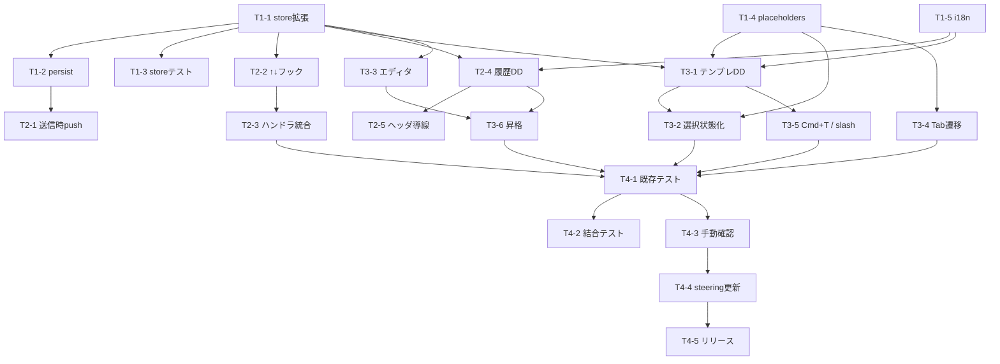

# WBS — プロンプトパレット 履歴・テンプレート機能

## 1. フェーズ概要

| フェーズ | 期間目安 | 主な成果物 |
|---|---|---|
| Phase 1: 基盤整備 | 2日 | ストア拡張、永続化、i18n 雛形、プレースホルダユーティリティ |
| Phase 2: 履歴機能 | 2日 | `↑`/`↓` 巡回、履歴ドロップダウン、送信時 push |
| Phase 3: テンプレート機能 | 3日 | テンプレドロップダウン、エディタ、プレースホルダ展開、`/` サジェスト、履歴→テンプレ昇格 |
| Phase 4: 統合・仕上げ | 2日 | 既存テストのグリーン化、結合テスト、手動シナリオ、ドキュメント反映 |

合計目安: **約 9 日**（1 人作業想定、バッファ含まず）

---

## 2. タスク分解

### Phase 1: 基盤整備

- [x] **T1-1**: `promptPaletteStore` のスキーマ拡張
  - 内容: `history` / `templates` / `historyCursor` / `dropdown` / `editorState` 型とアクション（`pushHistory`, `setHistoryCursor`, `openDropdown`, `closeDropdown`, `upsertTemplate`, `removeTemplate`, `openEditor`, `closeEditor`）を追加
  - 成果物: `src/stores/promptPaletteStore.ts`
  - 依存: なし
  - 規模: M

- [x] **T1-2**: `persist` middleware 適用
  - 内容: `appStore.ts` のパターンで `createJSONStorage(() => localStorage)` をラップ、`partialize` で `history` / `templates` のみ永続化、`version: 1` を設定
  - 成果物: `src/stores/promptPaletteStore.ts`
  - 依存: T1-1
  - 規模: S

- [x] **T1-3**: ストアテスト拡張
  - 内容: `pushHistory` の重複排除・100 件上限、`historyCursor` 境界、`upsertTemplate` / `removeTemplate`、persist の partialize 検証（24 件追加）
  - 成果物: `src/stores/promptPaletteStore.test.ts`
  - 依存: T1-1
  - 規模: M

- [x] **T1-4**: プレースホルダユーティリティ
  - 内容: `{{...}}` のパース、位置リスト計算、次位置検索（11 件テスト）
  - 成果物: `src/lib/templatePlaceholders.ts` + `.test.ts`
  - 依存: なし
  - 規模: M

- [x] **T1-5**: i18n キー雛形追加
  - 内容: `promptPalette.history.*`、`promptPalette.template.*`、`promptPalette.hint.*` 追加分を ja / en 両方に定義
  - 成果物: `src/i18n/locales/ja.json`, `src/i18n/locales/en.json`
  - 依存: なし
  - 規模: S

### Phase 2: 履歴機能

- [x] **T2-1**: 送信成功時の履歴 push
  - 内容: `handleSubmit` の成功ブロックで `pushHistory(body)` を呼ぶ。失敗時は push しない
  - 成果物: `src/components/PromptPalette/PromptPalette.tsx`
  - 依存: T1-2
  - 規模: S

- [x] **T2-2**: `↑`/`↓` 直近巡回フック
  - 内容: `usePromptHistoryCursor` 実装（空判定・IME 判定・カーソル末尾固定）
  - 成果物: `src/hooks/usePromptHistoryCursor.ts` + `.test.ts`
  - 依存: T1-1
  - 規模: M

- [x] **T2-3**: `PromptPalette.tsx` への巡回ハンドラ統合
  - 内容: `handleKeyDown` に `↑`/`↓` を追加、`handleChange` で `historyCursor` リセット
  - 成果物: `src/components/PromptPalette/PromptPalette.tsx`
  - 依存: T2-2
  - 規模: S

- [x] **T2-4**: 履歴ドロップダウン実装
  - 内容: `PromptHistoryDropdown` コンポーネント（検索・fuzzy・一覧・選択・流し込み）。`PathPalette.tsx` のフィルタ/ナビゲーションを参考
  - 成果物: `src/components/PromptPalette/PromptHistoryDropdown.tsx` + `.test.tsx`
  - 依存: T1-1, T1-5
  - 規模: L

- [x] **T2-5**: ヘッダアイコン＋`Cmd+H` 導線
  - 内容: `PromptPalette.tsx` のヘッダ右端にアイコン、`shortcuts.ts` にパレット内スコープのショートカット定義。Esc 段階剥離（`Dialog.Content` の `onEscapeKeyDown` でドロップダウン表示中はパレットを閉じない）を含む
  - 成果物: `src/components/PromptPalette/PromptPalette.tsx`, `src/lib/shortcuts.ts`
  - 依存: T2-4
  - 規模: S

### Phase 3: テンプレート機能

- [ ] **T3-1**: テンプレドロップダウン実装
  - 内容: `PromptTemplateDropdown`（検索・一覧・選択・新規/編集/削除導線）
  - 成果物: `src/components/PromptPalette/PromptTemplateDropdown.tsx` + `.test.tsx`
  - 依存: T1-1, T1-5, T1-4
  - 規模: L

- [ ] **T3-2**: 流し込み時のプレースホルダ選択状態化
  - 内容: `templatePlaceholders` の位置情報で textarea の最初のプレースホルダを `setSelectionRange` で選択
  - 成果物: `PromptTemplateDropdown.tsx` / `PromptPalette.tsx`
  - 依存: T1-4, T3-1
  - 規模: M

- [ ] **T3-3**: テンプレエディタ
  - 内容: `PromptTemplateEditor` モーダル（Radix Dialog）、名前・本文フォーム、バリデーション（名前ユニーク）、保存/キャンセル/削除確認
  - 成果物: `src/components/PromptPalette/PromptTemplateEditor.tsx` + `.test.tsx`
  - 依存: T1-1
  - 規模: L

- [ ] **T3-4**: `Tab` によるプレースホルダ遷移
  - 内容: textarea で `Tab` が押されたとき、現在カーソル位置以降の次の `{{...}}` を選択状態にする。なければ末尾カーソル
  - 成果物: `PromptPalette.tsx` の `handleKeyDown`
  - 依存: T1-4
  - 規模: M

- [ ] **T3-5**: `Cmd+T` と `/` サジェスト
  - 内容: `Cmd+T` でテンプレドロップダウンを開く。textarea 先頭での `/` でインラインサジェスト `SlashSuggest` を表示
  - 成果物: `src/components/PromptPalette/SlashSuggest.tsx` + `.test.tsx`, `PromptPalette.tsx`, `shortcuts.ts`
  - 依存: T3-1
  - 規模: M

- [ ] **T3-6**: 履歴→テンプレ昇格
  - 内容: 履歴行の「テンプレに保存」アクションで `PromptTemplateEditor` を起動する。エディタの初期値として履歴 body を流し込み、ユーザーが名前付けして保存
  - 成果物: `PromptHistoryDropdown.tsx` からエディタ呼び出し、必要に応じて `PromptTemplateEditor.tsx` に初期 body プロパティ対応
  - 依存: T2-4, T3-3
  - 規模: S

### Phase 4: 統合・仕上げ

- [ ] **T4-1**: 既存テスト互換性の確認
  - 内容: `PromptPalette.test.tsx` / `promptPaletteStore.test.ts` の既存ケースが全件グリーンを維持
  - 成果物: テスト結果
  - 依存: T2-*, T3-*
  - 規模: S

- [ ] **T4-2**: 結合テスト追加
  - 内容: 「F4 → `↑` → `Cmd+Enter`」「F4 → `Cmd+T` → テンプレ選択 → プレースホルダ Tab → `Cmd+Enter`」等のシナリオテスト
  - 成果物: `src/components/PromptPalette/PromptPalette.test.tsx` 拡張
  - 依存: T4-1
  - 規模: M

- [ ] **T4-3**: 手動確認（Tauri dev）
  - 内容: `npx tauri dev` で実 PTY へ送信、再起動後の永続化確認、`prefers-reduced-motion`、日本語 IME、macOS / Windows / Linux の差異確認（可能な環境で）
  - 成果物: 確認メモ
  - 依存: T4-1
  - 規模: M

- [ ] **T4-4**: steering ドキュメント更新
  - 内容: `docs/steering/features/prompt-palette.md` に履歴・テンプレ節を追加。`docs/steering/06_ubiquitous_language.md` にプレースホルダ用語を追加
  - 成果物: steering 配下の md
  - 依存: T4-3
  - 規模: S

- [ ] **T4-5**: リリースノート・バージョン更新
  - 内容: `package.json` / `Cargo.toml` / `tauri.conf.json` のバージョン更新、リリースノート
  - 成果物: バージョン関連ファイル
  - 依存: T4-4
  - 規模: S

---

## 3. 依存関係図

---

## 4. 既存コードベース起点のタスク整理

| 領域 | 対象ファイル/モジュール | 関連タスク |
|---|---|---|
| 再利用 | `src/stores/appStore.ts`（persist パターン） | T1-2（動作確認のみ） |
| 再利用 | `src/components/PathPalette/PathPalette.tsx`（fuzzy・↑↓Enter） | T2-4, T3-1（パターン参考） |
| 再利用 | `src/hooks/usePathInsertion.ts`（挿入ロジック） | T2-4, T3-1（`insertAtCaret` 流用） |
| 再利用 | 既存の `tauriApi.writePty` | T2-1（改修なしで呼び出しのみ） |
| 改修 | `src/stores/promptPaletteStore.ts` | T1-1, T1-2, T1-3 |
| 改修 | `src/components/PromptPalette/PromptPalette.tsx` | T2-1, T2-3, T2-5, T3-4, T3-5 |
| 改修 | `src/lib/shortcuts.ts` | T2-5, T3-5 |
| 改修 | `src/i18n/locales/ja.json`, `en.json` | T1-5 |
| 新規 | `src/components/PromptPalette/PromptHistoryDropdown.tsx` | T2-4, T3-6 |
| 新規 | `src/components/PromptPalette/PromptTemplateDropdown.tsx` | T3-1 |
| 新規 | `src/components/PromptPalette/PromptTemplateEditor.tsx` | T3-3 |
| 新規 | `src/components/PromptPalette/SlashSuggest.tsx` | T3-5 |
| 新規 | `src/hooks/usePromptHistoryCursor.ts` | T2-2 |
| 新規 | `src/lib/templatePlaceholders.ts` | T1-4 |

---

## 5. リスクと対策

| リスク | 影響 | 対策 |
|---|---|---|
| Radix Dialog 内にさらにドロップダウン/モーダルを重ねた際のフォーカス・`onPointerDownOutside` 誤発火 | 中 | ドロップダウン要素に `data-palette-dropdown` 属性を付与し、既存の外側クリック判定で例外扱いとする。T2-4 の最初期に動作確認 |
| `↑`/`↓` 巡回が Bash/Zsh のヒストリと紛らわしい | 低 | textarea が空のときのみ発動、フッタに小さくショートカットヒントを常時表示 |
| localStorage の容量上限（5〜10MB） | 低 | 履歴 100 件＋テンプレ 50 件では 1MB 未満を想定。`persist` 失敗時はトースト通知し、メモリ継続 |
| プレースホルダ Tab 遷移が既存の Tab（textarea → 次のフォーカス要素）と競合 | 中 | textarea 内に残プレースホルダが存在する間だけ Tab を preventDefault。なくなれば通常挙動に戻す |
| ユーザーがプロンプトに APIキー等を書いた場合、履歴が平文保存される | 中 | ドキュメントで明示。履歴クリアの UI を将来追加（今回スコープ外、README で言及） |
| 既存テスト `PromptPalette.test.tsx` のフォーカス・送信系テストへのリグレッション | 高 | T4-1 を独立タスクとして切り出し、Phase 2/3 完了時にスナップショット比較 |
| i18n キー追加漏れによる fallback 文字列表示 | 低 | T1-5 で先に雛形を確定させる |

---

## 6. マイルストーン

- [x] **M1**: Phase 1 完了 — ストア・永続化・ユーティリティが単体でグリーン。既存パレット挙動に変化なし
- [x] **M2**: Phase 2 完了 — 「F4 → `↑` → `Cmd+Enter`」で直近プロンプト再送できる。履歴ドロップダウンから流し込みできる
- [ ] **M3**: Phase 3 完了 — テンプレ新規作成・選択・プレースホルダ Tab 遷移まで動作。`/` サジェストが動作。履歴からテンプレートへの昇格が可能
- [ ] **M4**: リリース可能 — 全テストグリーン、手動シナリオ完了、steering 更新済み、バージョンタグ付与準備
