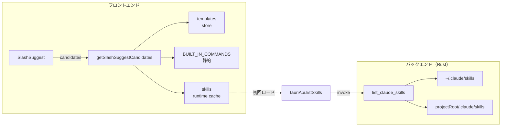
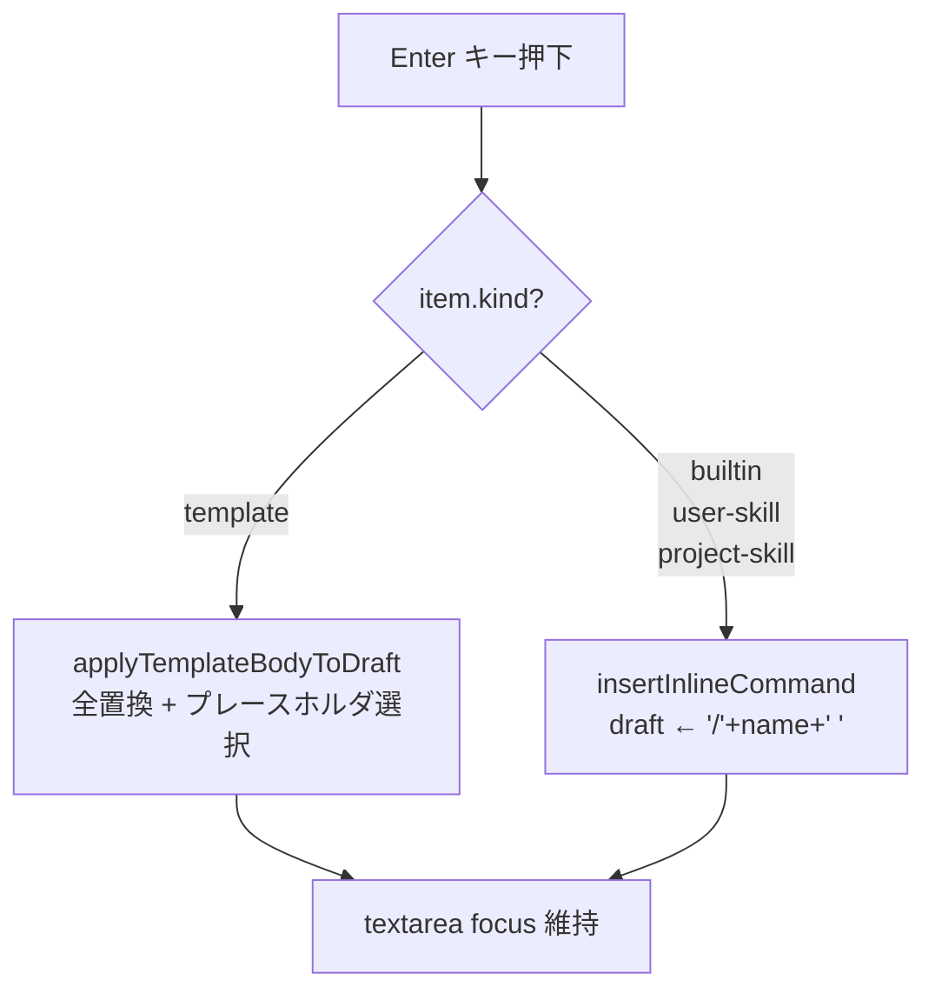

# 概要設計書 — Claude Code スラッシュコマンドサジェスト統合

**バージョン**: 1.0
**作成日**: 2026-04-19
**対象スコープ**: Phase A + Phase B

---

## 1. アーキテクチャ概要

プロンプトパレットの `/` サジェスト候補を **3 層のデータソース** から集約する構造を取る。既存の `PromptTemplate` 系統はそのまま維持し、**静的リスト**（Phase A）と **ファイルスキャン結果**（Phase B）を追加レイヤーとして合成する。



- **Phase A** は `SlashSuggest` 内で `templates + BUILT_IN_COMMANDS` を合成するのみで IPC なし
- **Phase B** でパレットが初回オープンされたタイミングで `list_claude_skills` を非同期呼び出しし、結果を `promptPaletteStore.skills` にキャッシュ

---

## 2. コンポーネント設計

### 2.1 フロントエンド

| コンポーネント／モジュール | 配置 | 責務 |
|---|---|---|
| `SlashSuggest`（改修） | `src/components/PromptPalette/SlashSuggest.tsx` | 候補リスト UI、fuzzy フィルタ、セクショングルーピング、バッジ表示 |
| `PromptPalette`（改修） | `src/components/PromptPalette/PromptPalette.tsx` | `handleSlashSelect` を kind 分岐に拡張。初回オープン時の `loadSkills` トリガー |
| `BUILT_IN_COMMANDS`（新規） | `src/lib/builtInCommands.ts` | 組み込み + バンドル Skill の静的リスト定義 |
| `SlashSuggestItem` 型（新規） | `src/lib/slashSuggestItem.ts` | 判別共用体型の定義と `getSlashSuggestCandidates` 合成関数 |
| `tauriApi.listSkills`（新規） | `src/lib/tauriApi.ts` | Rust `list_claude_skills` の wrapper |
| i18n 追加 | `src/i18n/locales/{ja,en}.json` | セクション見出し・バッジラベル |

### 2.2 バックエンド（Rust）

| モジュール | 配置 | 責務 |
|---|---|---|
| `skills`（新規） | `src-tauri/src/commands/skills.rs` | `list_claude_skills(project_root: Option<String>) -> Result<Vec<SkillMetadata>, String>` |
| `Cargo.toml` 追加 | `src-tauri/Cargo.toml` | `serde_yaml = "0.9"` 追加 |
| `main.rs` 登録 | `src-tauri/src/main.rs`（または `lib.rs`） | `.invoke_handler` に `list_claude_skills` を追加 |

### 2.3 状態管理

| ストア | 配置 | 管理対象 |
|---|---|---|
| `promptPaletteStore`（改修） | `src/stores/promptPaletteStore.ts` | `skills: SkillMetadata[]`、`skillsLoadedAt: number \| null` を追加。永続化対象外（`partialize` で除外） |

---

## 3. データフロー

### 3.1 Phase A: 静的リスト表示

1. ユーザーが `Cmd+Shift+P` でパレットを開く
2. textarea に `/rev` を入力
3. `parseSlashQuery(draft)` が `'rev'` を返す
4. `SlashSuggest` が `getSlashSuggestCandidates({ templates, skills: [], query: 'rev' })` を呼ぶ
5. 合成関数が `templates + BUILT_IN_COMMANDS` から fuzzy マッチした候補をセクションごとに返す
6. ユーザーが `↓` で候補選択・`Enter` で確定
7. `handleSlashSelect(item)` が kind 分岐で `applyTemplateBodyToDraft` か `insertInlineCommand` を呼ぶ

### 3.2 Phase B: Skill スキャン追加

1. パレットが `open(ptyId, tabName)` でオープン
2. `useEffect` で `promptPaletteStore.skillsLoadedAt === null` ならば `loadSkills(projectRoot)` を起動
3. `loadSkills` が `tauriApi.listSkills(projectRoot)` → `invoke('list_claude_skills', { projectRoot })` を発火
4. Rust 側で `~/.claude/skills/` と `projectRoot/.claude/skills/` を列挙
5. 各 `SKILL.md` を読み込み、`serde_yaml` で frontmatter をパース
6. `user-invocable: false` のスキルを除外
7. 同名衝突はユーザー側優先で重複排除
8. `Vec<SkillMetadata>` を返却
9. フロントエンドは `setSkills(result)` で store に反映、`skillsLoadedAt = Date.now()`
10. 以降、パレット再オープン時は**キャッシュヒット**（再スキャンしない）
11. 明示的にリロードしたい場合は ~~TBD のユーザー操作で~~ `skillsLoadedAt = null` にリセット（将来拡張として記載、初版では未実装）

### 3.3 候補選択時の分岐



---

## 4. IPC インターフェース

### コマンド

| コマンド名 | 引数 | 戻り値 | 説明 |
|---|---|---|---|
| `list_claude_skills` | `{ projectRoot?: string }` | `Result<Vec<SkillMetadata>, String>` | ユーザー Skill ディレクトリとオプションでプロジェクト Skill ディレクトリをスキャンし、SKILL.md frontmatter をパースして返す |

### イベント

本機能で新規のイベントは追加しない。

---

## 5. データ構造

### 5.1 フロントエンド

```typescript
// src/lib/slashSuggestItem.ts

export type SlashSuggestItem =
  | { kind: 'template'; id: string; name: string; body: string; description?: string }
  | { kind: 'builtin'; name: string; description: string }
  | { kind: 'user-skill'; name: string; description?: string; argumentHint?: string; path: string }
  | { kind: 'project-skill'; name: string; description?: string; argumentHint?: string; path: string }

export type SlashSuggestSection = {
  kind: SlashSuggestItem['kind']
  labelKey: string // i18n キー
  items: SlashSuggestItem[]
}

export function getSlashSuggestCandidates(input: {
  templates: PromptTemplate[]
  skills: SkillMetadata[]
  query: string
  maxPerSection?: number
}): SlashSuggestSection[]
```

```typescript
// src/lib/builtInCommands.ts

export interface BuiltInCommand {
  name: string
  description: string
}

export const BUILT_IN_COMMANDS: BuiltInCommand[] = [
  { name: 'resume',  description: 'Resume a previous session' },
  { name: 'clear',   description: 'Clear the current conversation' },
  { name: 'compact', description: 'Compact conversation history' },
  { name: 'help',    description: 'Show help' },
  { name: 'model',   description: 'Change the model' },
  { name: 'config',  description: 'Open settings' },
  { name: 'context', description: 'Show context usage' },
  { name: 'cost',    description: 'Show token cost' },
  { name: 'usage',   description: 'Show usage statistics' },
  { name: 'doctor',  description: 'Run diagnostics' },
  { name: 'feedback',description: 'Send feedback' },
  { name: 'login',   description: 'Log in to Anthropic' },
  { name: 'logout',  description: 'Log out' },
  { name: 'exit',    description: 'Exit Claude Code' },
  { name: 'permissions', description: 'Manage tool permissions' },
  { name: 'effort',  description: 'Change reasoning effort' },
  { name: 'theme',   description: 'Change color theme' },
  { name: 'rename',  description: 'Rename the current session' },
  { name: 'rewind',  description: 'Rewind to a checkpoint' },
  { name: 'branch',  description: 'Branch the conversation' },
  { name: 'diff',    description: 'Show conversation diff' },
  { name: 'desktop', description: 'Switch to desktop app' },
  { name: 'teleport',description: 'Pull web session into terminal' },
  // バンドル Skill
  { name: 'debug',   description: 'Enable debug logging' },
  { name: 'simplify',description: 'Review code quality and auto-fix' },
  { name: 'batch',   description: 'Large-scale parallel changes' },
  { name: 'loop',    description: 'Run prompt on recurring interval' },
  { name: 'claude-api', description: 'Load Claude API reference' },
]
```

### 5.2 バックエンド（Rust）

```rust
// src-tauri/src/commands/skills.rs

#[derive(Debug, Serialize, Deserialize)]
#[serde(rename_all = "camelCase")]
pub struct SkillMetadata {
    pub kind: SkillKind,          // "user" | "project"
    pub name: String,             // ディレクトリ名由来
    pub description: Option<String>,
    pub argument_hint: Option<String>,
    pub path: String,             // SKILL.md の絶対パス
}

#[derive(Debug, Serialize, Deserialize)]
#[serde(rename_all = "lowercase")]
pub enum SkillKind {
    User,
    Project,
}

#[derive(Debug, Deserialize)]
struct SkillFrontmatter {
    name: Option<String>,
    description: Option<String>,
    #[serde(rename = "argument-hint")]
    argument_hint: Option<String>,
    #[serde(rename = "user-invocable", default = "default_true")]
    user_invocable: bool,
    // その他フィールドは読み飛ばす
}

fn default_true() -> bool { true }

#[tauri::command]
pub fn list_claude_skills(
    project_root: Option<String>,
) -> Result<Vec<SkillMetadata>, String> {
    // 1. ~/.claude/skills/ を列挙
    // 2. project_root があれば <project_root>/.claude/skills/ を列挙
    // 3. 各 SKILL.md を読み frontmatter をパース
    // 4. user-invocable: false は除外
    // 5. 同名衝突はユーザー側優先
    // 6. Vec<SkillMetadata> を返す
}
```

### 5.3 store 拡張

```typescript
// src/stores/promptPaletteStore.ts (追加分)

interface PromptPaletteState {
  // 既存フィールド...

  skills: SkillMetadata[]            // runtime cache
  skillsLoadedAt: number | null      // null: 未ロード / 数値: Date.now()

  loadSkills(projectRoot?: string): Promise<void>
}

// partialize で skills / skillsLoadedAt を永続化対象外にする
```

---

## 6. 既存コードとの統合方針

### 既存実装の再利用

- `src/components/PromptPalette/SlashSuggest.tsx` — fuzzy マッチ関数・ActiveIndex 管理・キーハンドラの骨格は維持。候補ソースとレイアウトを差し替え
- `src/lib/slashQuery.ts` — `parseSlashQuery` は改修なし
- `src/lib/templateApply.ts` — テンプレ選択時の挙動は現状維持
- `src-tauri/src/commands/filesystem.rs` — `read_file` は内部で利用（Rust 側では `std::fs::read_to_string` 直接でも可）
- `src-tauri/capabilities/default.json` — `fs:read-all` が既に許可済みのため権限追加なし

### 既存実装の改修

- `SlashSuggest.tsx` — 単一 `PromptTemplate[]` 受け取りから `SlashSuggestSection[]` への UI 書き換え。影響範囲: テストケース（`SlashSuggest.test.tsx`）の再構成が必要
- `PromptPalette.tsx` の `handleSlashSelect` — 引数型を `PromptTemplate` から `SlashSuggestItem` に変更。テスト（`PromptPalette.test.tsx`）への影響あり
- `promptPaletteStore.ts` — `skills` / `skillsLoadedAt` / `loadSkills` 追加。`partialize` に除外指定を追加

### 新規追加

- `src/lib/builtInCommands.ts` — 組み込みコマンドリスト
- `src/lib/slashSuggestItem.ts` — 判別共用体型 + 候補合成関数
- `src/lib/builtInCommands.test.ts` — リストの重複チェック・形状テスト
- `src/lib/slashSuggestItem.test.ts` — fuzzy 合成・同名衝突解決・セクション並びのテスト
- `src-tauri/src/commands/skills.rs` — `list_claude_skills` 本体
- `src-tauri/src/commands/skills_test.rs`（または `#[cfg(test)] mod tests`）— frontmatter パース・衝突解決の単体テスト

---

## 7. エラーハンドリング

| エラーケース | 対処 |
|---|---|
| `~/.claude/skills/` が存在しない | `Ok(vec![])` を返す（エラーではない、未設定の通常ケース） |
| `SKILL.md` が存在しないディレクトリ | 無視してスキップ（警告ログのみ） |
| YAML パース失敗 | そのエントリだけスキップし、他は継続。`tracing::warn!` で記録 |
| `HOME` 環境変数未設定 | Phase B のみ `Err("HOME environment variable not set")`。フロントは toast で通知し、静的リスト + templates で継続動作 |
| `projectRoot` が渡されたが存在しない | ユーザー側のみスキャンして返す（プロジェクト側は空） |
| IPC 呼び出し失敗 | フロントは toast で通知、`skills` は `[]` のまま保持（Phase A 相当にフォールバック） |

---

## 8. セキュリティ・権限

- 既存 `src-tauri/capabilities/default.json` の `fs:read-all` で `~/.claude/skills/` / `<projectRoot>/.claude/skills/` は読み取り可能
- 追加の Tauri capability は **不要**
- スキャン対象パスは **Rust 側で固定**（ユーザー入力でパスを任意指定できない構造）
- `SKILL.md` の frontmatter 以外の本文は読まない（`description` / `argument-hint` のみ UI 表示）
- Skill body（テンプレ本文）はサジェスト UI には表示せず、メモリ上にも保持しない

---

## 9. テスト方針

### 単体テスト（Vitest）

- `src/lib/builtInCommands.test.ts` — 名前の一意性・空要素なし・アルファベット順序（任意）
- `src/lib/slashSuggestItem.test.ts`
  - `getSlashSuggestCandidates` の fuzzy マッチ
  - 同名衝突時のユーザー Skill 優先
  - セクション順（Claude Code → User Skills → Project Skills → Templates）
  - 空クエリ時の全件セクション表示
  - `maxPerSection` のリミット動作
- `src/components/PromptPalette/SlashSuggest.test.tsx`
  - セクション見出し表示
  - バッジテキスト（CMD/USER/PROJ/TPL）
  - 既存の ↑/↓/Enter キー操作が kind 混在下でも通る
- `src/stores/promptPaletteStore.test.ts` — `loadSkills` のキャッシュ動作（2 回目呼び出しが no-op）

### 単体テスト（Rust）

- `skills::tests::reads_user_skills_only`
- `skills::tests::merges_user_and_project_skills`
- `skills::tests::resolves_name_collision_user_wins`
- `skills::tests::excludes_non_user_invocable`
- `skills::tests::handles_missing_directory`
- `skills::tests::skips_broken_yaml`

### 結合テスト（手動）

- Phase A: `/` + `rev` → `/review`（組み込み）と `/review-pr`（ユーザーテンプレがあれば）両方候補表示
- Phase B-1: `~/.claude/skills/my-audit/SKILL.md` を作成 → パレット開閉で候補に出現
- Phase B-2: プロジェクト側にも `my-audit` を置く → ユーザー側のみ表示されることを確認
- 既存回帰: 既存 `PromptTemplate` 操作に影響なし

### アクセシビリティ

- セクション見出しに `role="group"` + `aria-label`
- 既存の `role="listbox"` / `role="option"` / `aria-selected` を維持

---

## 10. 段階的デリバリ方針

- **Phase A** を単独 PR で先行マージ（Rust 変更ゼロ、IPC ゼロでリスク最小）
- **Phase B** は Phase A の型基盤の上に乗る形で別 PR。`serde_yaml` 追加のため Cargo.lock 変更あり
- Phase A 時点で UX を評価し、Phase B の UI 調整（セクション見出し省略の要否等）にフィードバック

---

## 変更履歴

| 日付 | バージョン | 変更内容 | 作成者 |
|------|----------|---------|--------|
| 2026-04-19 | 1.0 | 初版作成（Phase A + Phase B） | - |
