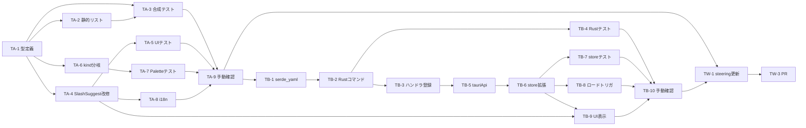

# WBS — Claude Code スラッシュコマンドサジェスト統合

**バージョン**: 1.0
**作成日**: 2026-04-19
**対象スコープ**: Phase A + Phase B（Phase C は将来拡張）

---

## 1. フェーズ概要

| フェーズ | 期間目安 | 主な成果物 |
|---|---|---|
| Phase A: 型基盤 + 組み込みコマンド静的リスト | 1.5 日 | `SlashSuggestItem` 型、`BUILT_IN_COMMANDS`、SlashSuggest の混在表示対応、単体テスト |
| Phase B: ローカル Skill ファイルスキャン | 2 日 | Rust `list_claude_skills`、frontmatter パース、promptPaletteStore の `skills` キャッシュ、結合テスト |
| Phase W: steering 反映・リリース準備 | 0.5 日 | `prompt-palette.md` 仕様更新、i18n 追加、CHANGELOG |

合計: 約 4 日（コードレビュー時間含まず）

---

## 2. タスク分解

### Phase A: 型基盤 + 静的リスト

- [ ] **TA-1**: `SlashSuggestItem` 型と候補合成関数の定義
  - 内容: `src/lib/slashSuggestItem.ts` を新規作成。判別共用体型と `getSlashSuggestCandidates` を実装
  - 成果物: `src/lib/slashSuggestItem.ts`
  - 依存: なし
  - 規模: S

- [ ] **TA-2**: 組み込みコマンド静的リスト
  - 内容: `src/lib/builtInCommands.ts` に `BUILT_IN_COMMANDS` を定義。組み込み 23 件 + バンドル Skill 5 件を収録
  - 成果物: `src/lib/builtInCommands.ts`
  - 依存: TA-1（型を参照）
  - 規模: S

- [ ] **TA-3**: 候補合成関数の単体テスト
  - 内容: fuzzy・同名衝突・セクション順・maxPerSection の網羅テスト。Vitest
  - 成果物: `src/lib/slashSuggestItem.test.ts`、`src/lib/builtInCommands.test.ts`
  - 依存: TA-1, TA-2
  - 規模: M

- [ ] **TA-4**: `SlashSuggest` コンポーネント改修
  - 内容: 候補を `SlashSuggestSection[]` で受けてセクション見出し + バッジ表示に変更。↑/↓/Enter キー操作がセクション横断で通るよう ActiveIndex ロジックを更新
  - 成果物: `src/components/PromptPalette/SlashSuggest.tsx`
  - 依存: TA-1
  - 規模: M

- [ ] **TA-5**: `SlashSuggest` テスト更新
  - 内容: 既存テストをセクション対応に書き換え。バッジ・グルーピング・キー操作の回帰カバー
  - 成果物: `src/components/PromptPalette/SlashSuggest.test.tsx`
  - 依存: TA-4
  - 規模: M

- [ ] **TA-6**: `handleSlashSelect` の kind 分岐対応
  - 内容: `PromptPalette.tsx` の `handleSlashSelect` に `kind === 'template'` / `'builtin'` 分岐を追加。`insertInlineCommand(name)` ヘルパで `/<name> ` を挿入
  - 成果物: `src/components/PromptPalette/PromptPalette.tsx`、`src/lib/templateApply.ts`（ヘルパ追加）
  - 依存: TA-1
  - 規模: S

- [ ] **TA-7**: `PromptPalette` テスト更新
  - 内容: 既存テストを Item 型に合わせて更新。builtin 選択時の `/<name> ` 挿入を検証
  - 成果物: `src/components/PromptPalette/PromptPalette.test.tsx`
  - 依存: TA-6
  - 規模: M

- [ ] **TA-8**: i18n リソース追加
  - 内容: セクション見出し 4 種（Claude Code/User Skills/Project Skills/Templates）とバッジラベル 4 種を ja/en に追加
  - 成果物: `src/i18n/locales/ja.json`、`src/i18n/locales/en.json`
  - 依存: TA-4
  - 規模: S

- [ ] **TA-9**: Phase A 手動動作確認
  - 内容: `npx tauri dev` で起動、`/` + 各種入力でサジェスト挙動を確認。macOS で実施
  - 成果物: 動作確認メモ（docs/working 配下に作業ドキュメント作成）
  - 依存: TA-1〜TA-8
  - 規模: S

### Phase B: ローカル Skill スキャン

- [ ] **TB-1**: `serde_yaml` 依存追加
  - 内容: `src-tauri/Cargo.toml` に `serde_yaml = "0.9"` 追加、`cargo build` で lock 更新
  - 成果物: `src-tauri/Cargo.toml`、`src-tauri/Cargo.lock`
  - 依存: なし
  - 規模: S

- [ ] **TB-2**: `list_claude_skills` Rust コマンド実装
  - 内容: `src-tauri/src/commands/skills.rs` を新規作成。`~/.claude/skills/` + `<projectRoot>/.claude/skills/` 列挙、frontmatter パース、同名衝突解決、`user-invocable: false` 除外
  - 成果物: `src-tauri/src/commands/skills.rs`
  - 依存: TB-1
  - 規模: L

- [ ] **TB-3**: `main.rs`/`lib.rs` への登録
  - 内容: `.invoke_handler(tauri::generate_handler![...])` に `list_claude_skills` を追加。`mod skills;` 宣言
  - 成果物: `src-tauri/src/main.rs`（または `lib.rs`）、`src-tauri/src/commands/mod.rs`
  - 依存: TB-2
  - 規模: S

- [ ] **TB-4**: Rust 単体テスト
  - 内容: tempdir で疑似 SKILL.md を配置し、`list_claude_skills` の挙動を検証。ユーザーのみ・プロジェクトのみ・両方・衝突・broken YAML・missing dir のケースをカバー
  - 成果物: `src-tauri/src/commands/skills.rs` 内 `#[cfg(test)] mod tests`
  - 依存: TB-2
  - 規模: M

- [ ] **TB-5**: `tauriApi.listSkills` wrapper 追加
  - 内容: `src/lib/tauriApi.ts` に `listSkills(projectRoot?: string): Promise<SkillMetadata[]>` を追加。型も同ファイルに export
  - 成果物: `src/lib/tauriApi.ts`
  - 依存: TB-3
  - 規模: S

- [ ] **TB-6**: `promptPaletteStore` に Skill キャッシュ追加
  - 内容: `skills`・`skillsLoadedAt` state、`loadSkills(projectRoot?)` アクションを追加。`partialize` で永続化対象外に
  - 成果物: `src/stores/promptPaletteStore.ts`
  - 依存: TB-5
  - 規模: M

- [ ] **TB-7**: store テスト更新
  - 内容: `loadSkills` のキャッシュ動作（2 回目は IPC 呼ばない）、エラー時のフォールバック挙動を追加
  - 成果物: `src/stores/promptPaletteStore.test.ts`
  - 依存: TB-6
  - 規模: M

- [ ] **TB-8**: パレット初回オープン時のロードトリガー
  - 内容: `PromptPalette.tsx` の `useEffect` で `isOpen && skillsLoadedAt === null` → `loadSkills(projectRoot)`。`projectRoot` は `appStore` 経由で取得
  - 成果物: `src/components/PromptPalette/PromptPalette.tsx`
  - 依存: TB-6
  - 規模: S

- [ ] **TB-9**: `SlashSuggest` が Skill セクションを表示
  - 内容: `getSlashSuggestCandidates` に store の `skills` を渡し、`user-skill` / `project-skill` セクションを表示
  - 成果物: `src/components/PromptPalette/SlashSuggest.tsx`、`src/lib/slashSuggestItem.ts`
  - 依存: TA-4, TB-6
  - 規模: S

- [ ] **TB-10**: Phase B 手動動作確認
  - 内容: `~/.claude/skills/test-skill/SKILL.md` を作成→ パレットで候補確認。プロジェクト側 `.claude/skills/` にも配置して同名優先確認
  - 成果物: 動作確認メモ
  - 依存: TB-1〜TB-9
  - 規模: S

### Phase W: ドキュメント・リリース準備

- [ ] **TW-1**: steering `prompt-palette.md` の PE-46 を実装済みに更新
  - 内容: PE-46 を「実装済み」ステータスに書き換え、v1.2 として変更履歴追加。データ構造 `SlashSuggestItem` の最終形を反映
  - 成果物: `docs/steering/features/prompt-palette.md`
  - 依存: TA-9, TB-10
  - 規模: S

- [ ] **TW-2**: 作業ドキュメント作成
  - 内容: Phase A / Phase B それぞれを `docs/working/20260419_*-phase-a` `docs/working/20260419_*-phase-b` として generate-working-docs で作成
  - 成果物: `docs/working/` 配下
  - 依存: なし（Phase 着手前に作成）
  - 規模: S

- [ ] **TW-3**: PR 分割とレビュー依頼
  - 内容: Phase A / Phase B を別 PR で提出。Phase A が先にマージされてから B を起こす
  - 成果物: GitHub PR
  - 依存: TA-9, TB-10
  - 規模: S

---

## 3. 依存関係図

---

## 4. 既存コードベース起点のタスク整理

| 領域 | 対象ファイル／モジュール | 関連タスク |
|---|---|---|
| 再利用 | `src/lib/slashQuery.ts` | なし（改修不要、動作確認のみ TA-9） |
| 再利用 | `src/lib/templateApply.ts`（applyTemplateBodyToDraft） | TA-6（ヘルパ追加で共存） |
| 再利用 | `src-tauri/capabilities/default.json`（fs:read-all） | TB-10（権限が足りるか確認のみ） |
| 改修 | `src/components/PromptPalette/SlashSuggest.tsx` | TA-4, TA-5, TB-9 |
| 改修 | `src/components/PromptPalette/PromptPalette.tsx` | TA-6, TA-7, TB-8 |
| 改修 | `src/stores/promptPaletteStore.ts` | TB-6, TB-7 |
| 改修 | `src/i18n/locales/{ja,en}.json` | TA-8 |
| 改修 | `docs/steering/features/prompt-palette.md` | TW-1 |
| 新規 | `src/lib/slashSuggestItem.ts` | TA-1 |
| 新規 | `src/lib/builtInCommands.ts` | TA-2 |
| 新規 | `src/lib/slashSuggestItem.test.ts` / `builtInCommands.test.ts` | TA-3 |
| 新規 | `src-tauri/src/commands/skills.rs` | TB-2, TB-4 |
| 新規 | `src-tauri/Cargo.toml` / `Cargo.lock`（依存追加） | TB-1 |
| 新規 | `src/lib/tauriApi.ts` の `listSkills` | TB-5 |

---

## 5. リスクと対策

| リスク | 影響 | 対策 |
|---|---|---|
| 組み込みコマンド一覧が Claude Code のバージョンでズレる | 中 | コメントに「2026-04 時点の公式 docs 準拠」を明記し、CHANGELOG で追随運用。将来の Phase C/D で動的取得を再検討 |
| SKILL.md の YAML frontmatter が公式仕様と微妙に異なる | 中 | TB-4 のテストで実サンプル（`~/.claude/skills/claude-code-guide/SKILL.md` 等）をフィクスチャ化して検証 |
| `serde_yaml` の導入でビルド時間・バイナリサイズが増える | 低 | 実測 200KB 未満想定。ユーザー影響は軽微。Phase B 合流時にサイズ確認 |
| `~/.claude/skills/` に **数百件** の Skill がある環境で初回ロードが遅い | 中 | `list_claude_skills` を並列化（`rayon` や `tokio::task::spawn_blocking`）検討。200ms 超なら Phase B 内で対処 |
| 既存 `PromptTemplate` UX の回帰 | 高 | TA-5 / TA-7 の既存テストを**すべてグリーン**にしてから Phase A マージ。手動確認 TA-9 で `/review-pr` など既存テンプレが従来通り動くこと検証 |
| Windows 環境で `~` 展開が動かない | 中 | Rust 側で `dirs` クレートを使用し、`dirs::home_dir()` で OS 非依存に |
| セクション数増で縦スペース圧迫 | 低 | 空セクションは非表示。`maxPerSection: 3` 等のリミットを default 動作に |

---

## 6. マイルストーン

- [ ] **M1**: Phase A 完了 — TA-1〜TA-9 完了。`/` で組み込みコマンドがサジェストされ、既存 PromptTemplate の挙動に回帰なし
- [ ] **M2**: Phase B 完了 — TB-1〜TB-10 完了。`~/.claude/skills/` と `<projectRoot>/.claude/skills/` の内容がサジェストに出現し、同名はユーザー優先で表示される
- [ ] **M3**: リリース可能 — TW-1〜TW-3 完了。steering が更新され、Phase A/B が別 PR として main にマージ済み

---

## 変更履歴

| 日付 | バージョン | 変更内容 | 作成者 |
|------|----------|---------|--------|
| 2026-04-19 | 1.0 | 初版作成（Phase A + Phase B） | - |
