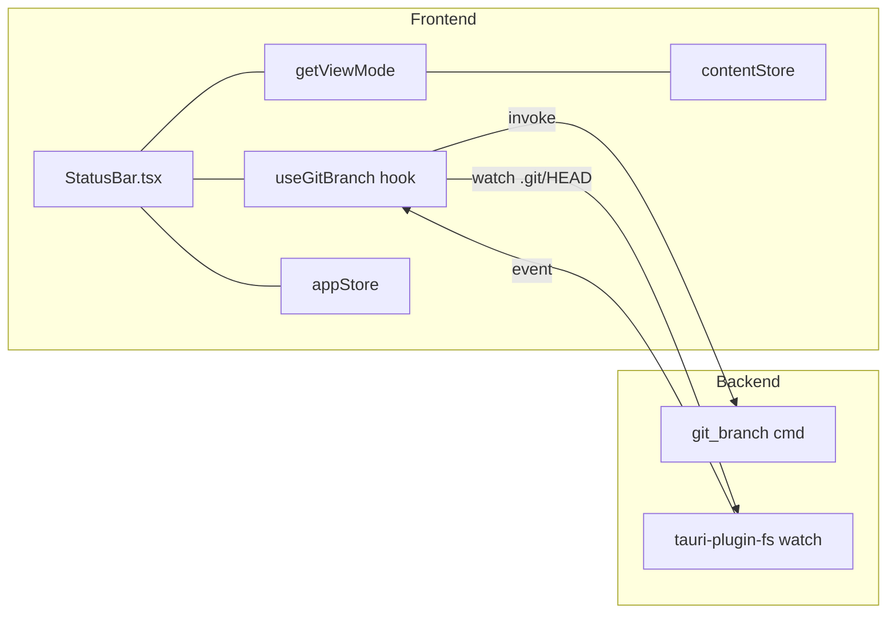

# 概要設計書 — ステータスバー機能

## 1. アーキテクチャ概要

ステータスバーは `AppLayout` 直下に配置される常設 UI 要素であり、以下 2 種のデータソースを持つ。

1. **Git ブランチ**: Rust 側の新設 `git_branch` コマンドと `.git/HEAD` のファイル監視。
2. **ファイル種別**: 既存の Zustand ストア（`appStore` + `contentStore`）と `getViewMode` による派生値。



---

## 2. コンポーネント設計

### 2.1 フロントエンド

| コンポーネント | 配置 | 責務 |
|---|---|---|
| `StatusBar` | `src/components/StatusBar/StatusBar.tsx` | 画面下部の表示領域を描画。ブランチ・ファイル種別をアイコン付きで表示 |
| `BranchIndicator` | `src/components/StatusBar/BranchIndicator.tsx` | ブランチ名セグメント。Git 非検出時は非表示 |
| `FileTypeIndicator` | `src/components/StatusBar/FileTypeIndicator.tsx` | ファイル種別セグメント。ターミナルモード時は非表示 |
| `useGitBranch` | `src/hooks/useGitBranch.ts` | cwd を受け取り、ブランチ名 state と `.git/HEAD` 監視の購読を提供 |

### 2.2 バックエンド（Rust）

| モジュール | 配置 | 責務 |
|---|---|---|
| `git_branch` | `src-tauri/src/commands/git.rs` | `git rev-parse --abbrev-ref HEAD` を実行。`HEAD` 戻り値時は `git rev-parse --short HEAD` を再実行して短縮 SHA を返す |

### 2.3 状態管理

| ストア | 配置 | 管理対象 |
|---|---|---|
| `appStore`（既存） | `src/stores/appStore.ts` | `activeMainTab`、アクティブプロジェクト cwd。StatusBar 表示制御のセレクタ入力 |
| `contentStore`（既存） | `src/stores/contentStore.ts` | `primary`/`secondary` のアクティブタブ filePath。ファイル種別セグメントの入力 |

※ ブランチ情報は StatusBar のローカル state（`useGitBranch`）で保持し、専用ストアは作らない。

---

## 3. データフロー

### 3.1 ブランチ更新フロー

1. ユーザーが `git checkout feature/xyz` をターミナルで実行。
2. `.git/HEAD` の内容が書き換わる（`ref: refs/heads/feature/xyz`）。
3. tauri-plugin-fs の watcher がファイル変更イベントを発火。
4. `useGitBranch` がイベントを受信し、`invoke("git_branch", { cwd })` を再実行。
5. 得られたブランチ名を React state に反映し、`BranchIndicator` が再描画。

### 3.2 ファイル種別更新フロー

1. ユーザーがツリーで別ファイルをクリック、または他のタブをアクティブ化。
2. `contentStore` の `activeTabId` が更新される。
3. `StatusBar` の selector（Zustand `subscribe` 経由）がアクティブ filePath を取得。
4. `getViewMode(filePath)` を呼び出し、種別ラベルを再描画。

### 3.3 モード切替フロー

1. ユーザーが `Ctrl+Tab` でターミナルモードへ切替。
2. `appStore.activeMainTab` が `'terminal'` になる。
3. `StatusBar` が selector で検知し、`FileTypeIndicator` を非表示に切替。

---

## 4. IPC インターフェース

### コマンド

| コマンド名 | 引数 | 戻り値 | 説明 |
|---|---|---|---|
| `git_branch` | `cwd: String` | `Result<Option<String>, String>` | ブランチ名または短縮 SHA。Git リポジトリでない場合は `Ok(None)` |

### イベント

| イベント名 | ペイロード | 発火元 → 受信元 |
|---|---|---|
| `fs-changed`（既存） | `{ path: String }` | tauri-plugin-fs → `useGitBranch` |

※ 既存のファイル監視基盤を流用するため、新規 Tauri イベントは定義しない。

---

## 5. データ構造

```typescript
// src/hooks/useGitBranch.ts
export function useGitBranch(cwd: string | null): {
  branch: string | null   // null = Git 非検出
  loading: boolean
}

// src/components/StatusBar/StatusBar.tsx
type StatusBarProps = {
  cwd: string | null
}

// 表示用のラベル対応
const FILE_TYPE_LABELS: Record<ViewMode, string> = {
  markdown: 'Markdown',
  code: 'Code',
  image: 'Image',
  plain: 'Plain',
}
```

```rust
// src-tauri/src/commands/git.rs
#[tauri::command]
pub fn git_branch(cwd: String) -> Result<Option<String>, String> { /* ... */ }
```

---

## 6. 既存コードとの統合方針

### 既存実装の再利用

- `src/lib/viewMode.ts` の `getViewMode` — ファイル種別判定ロジックをそのまま適用。追加の拡張子対応は不要。
- `src/stores/contentStore.ts` の `primary/secondary.tabs[activeTabId].filePath` — `StatusBar` の派生値として購読。
- `src-tauri/src/commands/git.rs` — 同ファイルに `git_branch` を追加し、既存の `std::process::Command` 実行パターンを踏襲。

### 既存実装の改修

- `src/components/Layout/AppLayout.tsx`
  - 変更前: `flex h-full w-full` の 1 カラムに `SplitPane` を 1 つだけ配置。
  - 変更後: `flex flex-col h-full w-full` に変更し、上段に `SplitPane`（`flex-1`）、下段に `StatusBar`（`h-7`）を配置。
- `src/components/MainArea/MainArea.tsx`
  - 現状の `h-full` を維持（親の `flex-1` 側で吸収するため改修不要となる想定）。
  - 念のため高さの積み上がりに不整合が出ないか動作確認する。
- `src/components/ContentView/ContentArea.tsx`
  - 同じく親 flex の挙動に依存するため直接の改修は最小限。

### 新規追加

- `src/components/StatusBar/` 配下のコンポーネント一式。
- `src/hooks/useGitBranch.ts`。
- `src-tauri/src/commands/git.rs` への `git_branch` 関数追加。
- `src-tauri/src/lib.rs`（コマンド登録側）に `git_branch` を `invoke_handler` に登録。

---

## 7. エラーハンドリング

| エラーケース | 対処 |
|---|---|
| cwd が Git リポジトリでない | `git rev-parse` が非ゼロで終了 → `Ok(None)` を返し、UI はブランチセグメントを非表示 |
| `git` コマンド未インストール | `Command::spawn` エラー → `Ok(None)` 扱い（UI は壊さない） |
| `.git/HEAD` 監視登録失敗 | コンソール警告のみ。初回取得結果だけが表示される（ポーリングへのフォールバックは初期リリース不要） |
| ブランチ名取得中にプロジェクト切替 | 前プロジェクトの in-flight 結果は破棄する（AbortController 相当。クリーンアップ関数で `disposed` フラグ） |

---

## 8. セキュリティ・権限

- Tauri v2 capability: `fs:read-all` が必要（`.git/HEAD` 読み取り・監視）。既存設定で充足している想定。
- `git_branch` コマンドはフロント側から cwd を渡す。cwd はユーザーが明示的に開いたプロジェクトディレクトリに限定し、任意のパスインジェクションを防ぐ（`appStore` のアクティブプロジェクト以外は呼ばない）。
- 子プロセス（`git`）の標準出力は UTF-8 として扱う。ブランチ名に想定外文字が含まれる場合は生文字列を表示（サニタイズは行わない）。

---

## 9. テスト方針

- **単体テスト（Rust）**:
  - `git_branch` を Git 初期化済みテンポラリディレクトリで呼び出し、ブランチ名が返ることを確認。
  - Git 未初期化ディレクトリでは `Ok(None)` となることを確認。
  - detached HEAD 状態で短縮 SHA が返ることを確認。
- **単体テスト（フロント）**:
  - `useGitBranch` フックを `@testing-library/react` でレンダーし、IPC モックの戻り値に応じて state が更新されることを確認。
  - `StatusBar` の表示切替（ターミナルモード、プロジェクト未オープン、ファイル未選択）をスナップショット／レンダーテストで確認。
- **手動確認**:
  - `npx tauri dev` で起動し、`git checkout` / `git branch -c` を実行してステータスバーが追従することを確認。
  - コンテンツモード ⇔ ターミナルモードの切替でファイル種別が表示/非表示になることを確認。
  - Git 未初期化ディレクトリを開いてもクラッシュしないことを確認。
