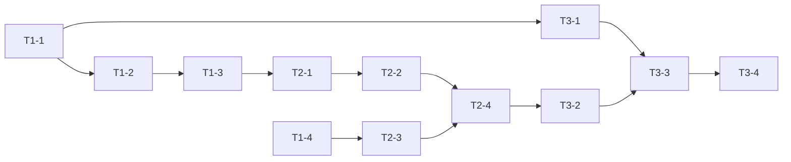

# WBS — ステータスバー機能

## 1. フェーズ概要

| フェーズ | 期間目安 | 主な成果物 |
|---|---|---|
| Phase 1: 基盤整備（Rust コマンド + レイアウト枠） | 1 日 | `git_branch` コマンド、AppLayout のステータスバー枠、空の StatusBar コンポーネント |
| Phase 2: 機能実装（Git 監視 + ファイル種別） | 1.5 日 | `useGitBranch` フック、BranchIndicator / FileTypeIndicator の表示、モード連動 |
| Phase 3: 統合テスト・仕上げ | 0.5 日 | 手動 QA、単体テスト追加、コミット準備 |

---

## 2. タスク分解

### Phase 1: 基盤整備

- [ ] **T1-1**: `git_branch` コマンド実装
  - 内容: `src-tauri/src/commands/git.rs` に `git_branch(cwd: String) -> Result<Option<String>, String>` を追加。`git rev-parse --abbrev-ref HEAD` を実行し、`HEAD` 戻り値時は `git rev-parse --short HEAD` で短縮 SHA を取得。Rust 単体テストを併記。
  - 成果物: `src-tauri/src/commands/git.rs`
  - 依存: なし
  - 規模: S

- [ ] **T1-2**: コマンド登録
  - 内容: `src-tauri/src/lib.rs`（または `main.rs`）の `invoke_handler` に `git_branch` を追加。
  - 成果物: `src-tauri/src/lib.rs`
  - 依存: T1-1
  - 規模: S

- [ ] **T1-3**: フロント IPC ラッパー追加
  - 内容: `src/lib/tauriApi.ts` に `getBranch(cwd: string): Promise<string | null>` を追加。戻り値の `Option` を `null` に正規化。
  - 成果物: `src/lib/tauriApi.ts`
  - 依存: T1-2
  - 規模: S

- [ ] **T1-4**: ステータスバー枠の配置
  - 内容: `src/components/Layout/AppLayout.tsx` を `flex flex-col` 構造へ変更。下段に高さ 28px（`h-7`）の StatusBar 空コンポーネントを配置。SplitPane が `flex-1` で残りを占有することを確認。
  - 成果物: `src/components/Layout/AppLayout.tsx`, `src/components/StatusBar/StatusBar.tsx`（スケルトン）
  - 依存: なし（T1-1〜3 と並行可）
  - 規模: M

### Phase 2: 機能実装

- [ ] **T2-1**: `useGitBranch` フック実装
  - 内容: `src/hooks/useGitBranch.ts` を作成。引数 cwd から初回ブランチ取得 + `.git/HEAD` のファイル監視登録 + クリーンアップ処理。cwd 変更時は監視を差し替え。
  - 成果物: `src/hooks/useGitBranch.ts`
  - 依存: T1-3
  - 規模: M

- [ ] **T2-2**: `BranchIndicator` コンポーネント
  - 内容: Git アイコン + ブランチ名の表示。`branch === null` の場合は何も描画しない。
  - 成果物: `src/components/StatusBar/BranchIndicator.tsx`
  - 依存: T2-1
  - 規模: S

- [ ] **T2-3**: `FileTypeIndicator` コンポーネント
  - 内容: `contentStore` から現在の filePath を購読し `getViewMode` を適用。種別ラベル + アイコン表示。ターミナルモード時・ファイル未選択時は非表示。
  - 成果物: `src/components/StatusBar/FileTypeIndicator.tsx`
  - 依存: T1-4
  - 規模: M

- [ ] **T2-4**: `StatusBar` 統合
  - 内容: `BranchIndicator` と `FileTypeIndicator` を配置し、モードに応じた表示制御を統合。左端にブランチ、右端にファイル種別という VS Code 風レイアウト。
  - 成果物: `src/components/StatusBar/StatusBar.tsx`
  - 依存: T2-2, T2-3
  - 規模: S

### Phase 3: 統合テスト・仕上げ

- [ ] **T3-1**: Rust 単体テスト追加
  - 内容: `git_branch` のテストを既存 `tests` モジュールに追加。テンポラリ Git リポジトリ（`tempfile` クレート）でブランチ名・detached HEAD・非 Git ディレクトリの 3 ケースを検証。
  - 成果物: `src-tauri/src/commands/git.rs` の `tests` モジュール
  - 依存: T1-1
  - 規模: M

- [ ] **T3-2**: フロント単体テスト追加（可能な範囲）
  - 内容: `useGitBranch` を IPC モックしてレンダーし state 反映を確認。`StatusBar` の表示制御を render テスト。
  - 成果物: 各コンポーネントの `*.test.tsx`（構成に合わせて）
  - 依存: T2-4
  - 規模: M

- [ ] **T3-3**: 手動 QA
  - 内容: `npx tauri dev` で以下を確認:
    1. ブランチ切替（`git checkout`, `git switch -c`）時に 1 秒以内に表示更新。
    2. ファイル切替でファイル種別ラベル更新。
    3. ターミナルモードで種別ラベル非表示。
    4. Git 未初期化ディレクトリを開いてもエラーなし。
    5. 分割レイアウト時の高さ崩れなし。
  - 成果物: 確認ログ（自己チェック）
  - 依存: T3-1, T3-2
  - 規模: S

- [ ] **T3-4**: コミット準備
  - 内容: diff を整理し、ユーザー確認を依頼（CLAUDE.md 作業ルール準拠）。承認後にコミット。
  - 成果物: コミット
  - 依存: T3-3
  - 規模: S

---

## 3. 依存関係図

---

## 4. 既存コードベース起点のタスク整理

| 領域 | 対象ファイル/モジュール | 関連タスク |
|---|---|---|
| 再利用 | `src/lib/viewMode.ts` | T2-3（動作確認のみ） |
| 再利用 | `src/stores/appStore.ts`, `src/stores/contentStore.ts` | T2-3, T2-4（selector 追加） |
| 再利用 | `src-tauri/src/commands/git.rs` 内 `std::process::Command` パターン | T1-1 |
| 再利用 | `src/index.css` CSS 変数 | T1-4, T2-2, T2-3 |
| 改修 | `src/components/Layout/AppLayout.tsx` | T1-4 |
| 改修 | `src-tauri/src/lib.rs`（invoke_handler） | T1-2 |
| 改修 | `src/lib/tauriApi.ts` | T1-3 |
| 新規 | `src/components/StatusBar/*` | T1-4, T2-2, T2-3, T2-4 |
| 新規 | `src/hooks/useGitBranch.ts` | T2-1 |
| 新規 | `git_branch` Rust 関数 | T1-1 |

---

## 5. リスクと対策

| リスク | 影響 | 対策 |
|---|---|---|
| `.git/HEAD` 監視が OS（特に Windows）で取りこぼす | 中 | tauri-plugin-fs のドキュメントに沿った監視登録。万一安定しない場合は `.git/HEAD` + `.git/packed-refs` を複数監視し、最後の手段としてターミナル OSC 連動や手動リロードで救済 |
| `git rev-parse` のコールド呼び出しが 100ms を超える環境がある | 低 | 初回取得を非同期化し、UI は取得完了まで空表示。以後は監視イベント駆動でオーバーヘッドを最小化 |
| detached HEAD 時の表示フォーマットが分かりにくい | 低 | アイコン色を少し変えるなど視覚差別化を後続対応として検討（初期リリースは短縮 SHA 表示のみ） |
| 既存レイアウトの高さ計算が壊れる | 中 | T1-4 で手動確認。分割レイアウトやモード切替時にスクロール位置が壊れないか重点チェック |

---

## 6. マイルストーン

- [ ] **M1**: Phase 1 完了 — `git_branch` コマンドが curl 可能／ステータスバー枠が画面下部に出ている
- [ ] **M2**: Phase 2 完了 — ブランチとファイル種別が正しく表示・更新される
- [ ] **M3**: リリース可能 — 手動 QA・単体テスト・コミット完了、main へマージできる状態
