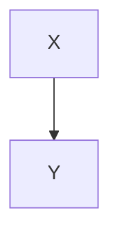

# テスト手順書 - mermaid-error-display

## 概要

Mermaid 構文エラー発生時にエラーメッセージをマークダウンプレビュー上に表示する機能の検証手順を記載する。可能な限り手動操作で確認し、操作で確認できない項目のみ静的解析・自動テストで補完する。

## 前提条件

- `npx tauri dev` でアプリが起動していること
- テスト用に以下の `.md` ファイルを任意のプロジェクトフォルダに用意できること

### テスト用フィクスチャ

**A. 構文エラーを含む Mermaid（単独）** — `mermaid-error.md`

````markdown
# Mermaid Error Test

```mermaid
notADiagramType
  A --> B
```
````

> 先頭のダイアグラム種別を未知の文字列にすると Mermaid のディスパッチで失敗するため、確実にエラーパネルが表示される。

**B. 正常な Mermaid（回帰用）** — `mermaid-ok.md`

````markdown
# Mermaid OK Test


````

**C. 正常 + エラー混在** — `mermaid-mixed.md`

````markdown
# Mixed

正しい図:



壊れた図:

```mermaid
flowchart TD
  A --> B -->
```
````

> 注: `???foo???` のような記号列は Mermaid のフローチャートではノード ID として有効に解釈され、エラーにならない。確実に構文エラーを起こすには「矢印の右辺を欠落させる」「ダイアグラム種別を未知の文字列にする」など文法に違反する内容を使う。

## 手動テスト

### ケース 1: 構文エラーがエラーパネルとして表示される

**手順:**

1. `npx tauri dev` でアプリを起動する
2. `mermaid-error.md` を含むプロジェクトを開く
3. ツリーから `mermaid-error.md` をクリックして開く
4. プレビュー領域にエラーパネルが表示されることを確認する

**期待結果:**

- 元の `<pre><code>` ではなく、エラーパネル（見出し「Mermaid 構文エラー」+ エラーメッセージ）が表示される
- エラーメッセージに Mermaid から得られた原文（例: `Parse error...`）が含まれる
- 「元のコード」を展開すると入力した Mermaid コードが等幅で表示される

**確認結果:**

- [ ] OK / NG

---

### ケース 2: 正常な Mermaid は従来どおり SVG 描画される（回帰チェック）

**手順:**

1. `mermaid-ok.md` を開く
2. プレビューを目視で確認する

**期待結果:**

- ノード `Start` → `End` の SVG ダイアグラムが描画される
- エラーパネルは表示されない

**確認結果:**

- [ ] OK / NG

---

### ケース 3: 同一ファイルでの正常/エラー混在

**手順:**

1. `mermaid-mixed.md` を開く
2. プレビューに 2 つの Mermaid ブロックが現れることを確認する

**期待結果:**

- 1 つ目（正常）は SVG として描画される
- 2 つ目（エラー）はエラーパネルとして描画される
- 互いに描画が干渉しない（正常側がエラー表示に化けない／エラー側が空にならない）

**確認結果:**

- [ ] OK / NG

---

### ケース 4: ファイルを切り替えても一時要素が残らない

**手順:**

1. `mermaid-error.md` → `mermaid-ok.md` → `mermaid-error.md` の順で開きなおす
2. 各回のプレビューを確認する

**期待結果:**

- 切り替えのたびに正しい状態（エラー or 正常）が表示される
- ページ末尾や DOM 内に Mermaid の一時要素（`d...` で始まる ID 等）が残っていない

**確認結果:**

- [ ] OK / NG（DevTools の Elements タブで補助確認）

---

### ケース 5: ライト/ダーク両テーマで視認できる

**手順:**

1. 設定からテーマをライトに切り替え、`mermaid-error.md` を確認
2. 設定からテーマをダークに切り替え、同ファイルを確認

**期待結果:**

- どちらのテーマでもエラーパネルの背景・ボーダー・テキストが読み取れる
- 文字色が背景に埋もれない

**確認結果:**

- [ ] OK / NG

---

### ケース 6: ファイル監視による再描画でもエラー表示が更新される

**手順:**

1. `mermaid-error.md` を開いた状態で外部エディタを起動
2. 構文エラーを含む箇所を修正して保存
3. プレビューが自動更新されることを確認

**期待結果:**

- ファイル変更検知（`file-changed` イベント）でプレビューが再レンダリングされる
- 修正が正しければエラーパネルが消えて SVG が出る／まだエラーなら新しいエラーメッセージに更新される

**確認結果:**

- [ ] OK / NG

---

## 自動テスト

### フロントエンドテスト（Vitest）

```bash
npm run test
```

> `escapeHtml` のような純粋ヘルパを切り出した場合のみ単体テスト対象。Mermaid 自体の挙動は手動テストで確認する。

### Lint

```bash
npm run lint
```

### 型チェック

```bash
npm run build  # TypeScript エラーがないことを確認
```

### Rust の型チェック（影響範囲外の念のため）

```bash
cd src-tauri && cargo check
```

## エッジケース

| ケース | 期待動作 | 確認結果 |
|---|---|---|
| 空の Mermaid ブロック（` ```mermaid\n``` `） | エラーパネル or 空 SVG（クラッシュしない） | [ ] OK / NG |
| 非常に長いエラーメッセージ（数千文字） | パネル内で折り返して表示、横スクロールで画面が壊れない | [ ] OK / NG |
| HTML 特殊文字を含むエラー文言 / 入力コード | エスケープされプレーンテキストとして表示される（`<script>` 等が実行されない） | [ ] OK / NG |
| 同一エラー Mermaid を複数回貼った MD | すべてエラーパネルとして表示、ID 衝突が起きない | [ ] OK / NG |

## 回帰テスト

既存機能への影響がないことを確認する。

- [ ] ファイルツリーが正常に表示される
- [ ] ターミナルが正常に起動・動作する
- [ ] コンテンツビューア（コード/プレーンテキスト/画像）が正常に動作する
- [ ] マークダウンの非 Mermaid 部分（リンク・画像・コードハイライト）が従来どおり描画される
- [ ] テーマ切り替え・フォント設定が機能する
